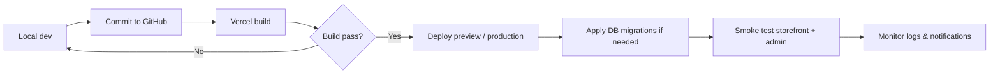

# Fashion Point

[](https://nextjs.org/)
[](https://react.dev/)
[](https://www.typescriptlang.org/)
[](https://supabase.com/)
[](https://tailwindcss.com/)

Production e-commerce platform for **Fashion Point** — a premium readymade Indian blouse storefront with admin operations, order fulfillment, and AI-assisted shopping tools.

**License:** Private Client Project — proprietary software. Not licensed for redistribution or public use without written permission from the client.

---

## Overview

Fashion Point is a full-stack web application built on **Next.js App Router**. The storefront sells catalog products from **Supabase**, supports **Razorpay** online payments and **COD**, and includes customer accounts, wishlists, product reviews, and AI shopping assistants. A separate **admin panel** manages products, categories, inventory, orders, analytics, and staff notifications.

Categories are **fully database-driven**: new categories created in admin are available at `/category/{slug}` without code changes. Legacy bare URLs (for example `/daily-wear`) redirect to the matching category when an active slug exists in the database.

---

## Key Features

### Storefront

| Feature | Description |
|--------|-------------|
| **Product catalog** | Browse all products, search, filter, and view product detail pages with variants (size/color), images, and stock |
| **Dynamic categories** | Category pages at `/category/[slug]` with sub-category filters, related categories, and DB-driven navigation |
| **Cart & checkout** | Cart persistence, shipping quotes, address capture, Razorpay checkout, and COD |
| **Customer accounts** | Sign up / login (Supabase Auth), dashboard, profile, addresses, order history, saved measurements |
| **Wishlist** | Save products; syncs with database for signed-in users |
| **Product reviews** | Verified-purchase reviews with ratings, moderation, and realtime sync |
| **Policies & content** | About, contact, size guide, privacy/terms/shipping/return/refund policies |
| **Blog** | Blog listing and post pages (sample content from in-repo mock data) |

### AI Shopping Tools (customer-facing)

| Feature | Route | Description |
|--------|-------|-------------|
| **AI Size Finder** | `/ai-features/size-finder` | Rule-based size recommendation from body measurements |
| **Saree Color Matcher** | `/ai-features/color-matcher` | Client-side saree color extraction and blouse color recommendations from live catalog |
| **AI Style Recommender** | `/ai-features/style-recommender` | Preference-based style recommendations with matching products |
| **AI Stylist Chatbot** | Store layout (floating widget) | Inventory-aware chat that searches products and categories from the database |

### Admin & Operations

| Feature | Description |
|--------|-------------|
| **Dashboard** | KPIs, action-required orders, recent orders, sales charts |
| **Products & variants** | CRUD, images, stock, featured/bestseller flags, back-in-stock requests |
| **Categories & sub-categories** | CRUD, homepage display, navbar placement, mega-menu dropdowns |
| **Orders** | Full lifecycle (processing → packed → shipped → delivered), cancellations, refunds, returns, worker assignment |
| **Inventory** | Stock levels, low-stock visibility, analytics |
| **Reviews** | Approve / reject / delete customer reviews |
| **Analytics & reports** | Sales, orders, products, inventory, reviews; export reports |
| **AI growth** | Action center, conversion, customer/product/revenue insights, suggestions |
| **Settings** | Shipping, notification recipients, admin configuration |
| **Worker portal** | `/admin/worker` for packing/shipping workflow |
| **Notifications** | Email, WhatsApp, in-app, and push alerts for new orders and fulfillment events |

---

## Technology Stack

| Category | Technologies |
|----------|--------------|
| **Framework** | Next.js 15 (App Router), React 19, TypeScript |
| **Styling & UI** | Tailwind CSS, Framer Motion, Radix UI, Lucide icons |
| **State** | Zustand, React Hook Form, Zod |
| **Database & Auth** | Supabase (PostgreSQL, Auth, Row Level Security, Realtime) |
| **Payments** | Razorpay |
| **Images** | Cloudinary (production uploads); data-URL fallback in development |
| **Email** | Resend |
| **Messaging** | Twilio (WhatsApp admin alerts) |
| **Push notifications** | Firebase Cloud Messaging, Web Push (VAPID fallback via `web-push`) |
| **Charts** | Recharts |
| **AI / automation** | OpenAI GPT-4o (admin product image analysis API only), deterministic style/size logic, Replicate API route (virtual try-on backend, not exposed in storefront UI) |
| **Deployment** | Vercel (recommended), Node.js 18+ |

---

## Architecture Overview

```
┌─────────────────────────────────────────────────────────────────┐
│                     Next.js App (src/app)                        │
├──────────────────────────┬──────────────────────────────────────┤
│   Storefront (store)     │   Admin Panel (admin)                 │
│   Server + Client comps  │   Client dashboards + API consumers   │
├──────────────────────────┴──────────────────────────────────────┤
│   API Routes (src/app/api) — orders, payment, reviews, AI, cron   │
├─────────────────────────────────────────────────────────────────┤
│   Domain logic (src/lib) — products, orders, categories, AI, etc. │
├─────────────────────────────────────────────────────────────────┤
│   Supabase (Postgres + Auth + Realtime) │ Cloudinary │ Razorpay  │
│   Resend │ Twilio │ Firebase / Web Push                          │
└─────────────────────────────────────────────────────────────────┘
```

- **Server Components** load catalog, category, and page data from Supabase via service-role/server clients.
- **Client Components** handle cart, wishlist, checkout UI, filters, and AI interactive tools.
- **Middleware** (`src/middleware.ts`) protects customer account routes and admin panel, resolves legacy category URL redirects, and manages auth session cookies.
- **API routes** encapsulate mutations (orders, payments, admin actions) and integrations (email, WhatsApp, push, cron).

---

## Folder Structure

```
FashionPoint/
├── src/
│   ├── app/
│   │   ├── (store)/          # Public storefront pages
│   │   ├── (admin)/admin/    # Admin panel pages
│   │   ├── api/              # REST API route handlers
│   │   ├── ai/               # Legacy redirects → /ai-features
│   │   ├── auth/             # Supabase auth callback
│   │   ├── admin/login/      # Admin login
│   │   └── offers/           # Offers redirect (category or /products)
│   ├── components/
│   │   ├── store/            # Storefront UI (navbar, product cards, checkout)
│   │   ├── admin/            # Admin UI
│   │   ├── ai/               # AI feature components + stylist chatbot
│   │   ├── reviews/          # Review panels and forms
│   │   └── wishlist/         # Wishlist UI
│   ├── lib/                  # Business logic, Supabase helpers, integrations
│   ├── hooks/                # Shared React hooks
│   ├── stores/               # Zustand stores (cart, wishlist, checkout)
│   ├── types/                # Shared TypeScript types
│   └── emails/               # Email templates
├── supabase/
│   ├── schema.sql            # Base schema (run first on new projects)
│   ├── migrations/           # Incremental SQL migrations (apply in order)
│   └── seed-categories.sql   # Optional category seed data
├── public/                   # Static assets
├── docs/                     # Supplemental documentation
├── .env.local.example        # Environment variable template
└── package.json
```

---

## Installation

### Prerequisites

- **Node.js** 18 or later
- **npm** (or compatible package manager)
- **Supabase** project
- Accounts for **Cloudinary**, **Razorpay**, **Resend**, and **Twilio** (as needed for production)

### Steps

```bash
# Clone the repository
git clone <repository-url>
cd FashionPoint

# Install dependencies
npm install

# Copy environment template
cp .env.local.example .env.local

# Edit .env.local with your credentials (see Environment Variables below)

# Apply database schema (see Database section)

# Start development server
npm run dev
```

Open [http://localhost:3000](http://localhost:3000) for the storefront. Admin panel: [http://localhost:3000/admin/login](http://localhost:3000/admin/login).

---

## Environment Variables

Copy `.env.local.example` to `.env.local`. **Never commit secrets.** Variable names only:

| Variable | Purpose |
|----------|---------|
| `NEXT_PUBLIC_SUPABASE_URL` | Supabase project URL |
| `NEXT_PUBLIC_SUPABASE_ANON_KEY` | Supabase anonymous (public) key |
| `SUPABASE_SERVICE_ROLE_KEY` | Supabase service role key (server only) |
| `CLOUDINARY_CLOUD_NAME` | Cloudinary cloud name |
| `CLOUDINARY_API_KEY` | Cloudinary API key |
| `CLOUDINARY_API_SECRET` | Cloudinary API secret |
| `RAZORPAY_KEY_ID` | Razorpay key ID (server) |
| `RAZORPAY_KEY_SECRET` | Razorpay key secret |
| `NEXT_PUBLIC_RAZORPAY_KEY_ID` | Razorpay key ID (client checkout) |
| `GOOGLE_CLOUD_VISION_API_KEY` | Listed in env template (not used by current color matcher; extraction is client-side) |
| `OPENAI_API_KEY` | OpenAI API key (admin product-generator route) |
| `RESEND_API_KEY` | Resend email API key |
| `TWILIO_ACCOUNT_SID` | Twilio account SID |
| `TWILIO_AUTH_TOKEN` | Twilio auth token |
| `TWILIO_WHATSAPP_FROM` | Twilio WhatsApp sender |
| `TWILIO_WHATSAPP_NUMBER` | Twilio WhatsApp number alias |
| `APP_URL` | Canonical app URL for email action links |
| `NEXT_PUBLIC_APP_URL` | Optional public app URL fallback |
| `ADMIN_EMAIL` | Admin alert email recipient |
| `WORKER_EMAILS` | Comma-separated worker email inboxes |
| `ADMIN_PHONE` | Admin phone (WhatsApp alerts) |
| `ADMIN_WHATSAPP_TO` | Optional WhatsApp destination override |
| `NEXT_PUBLIC_FIREBASE_API_KEY` | Firebase client config |
| `NEXT_PUBLIC_FIREBASE_AUTH_DOMAIN` | Firebase auth domain |
| `NEXT_PUBLIC_FIREBASE_PROJECT_ID` | Firebase project ID |
| `NEXT_PUBLIC_FIREBASE_STORAGE_BUCKET` | Firebase storage bucket |
| `NEXT_PUBLIC_FIREBASE_MESSAGING_SENDER_ID` | Firebase messaging sender ID |
| `NEXT_PUBLIC_FIREBASE_APP_ID` | Firebase app ID |
| `NEXT_PUBLIC_FIREBASE_VAPID_KEY` | Firebase VAPID public key |
| `FIREBASE_SERVER_KEY` | Optional FCM legacy server key |
| `NEXT_PUBLIC_VAPID_PUBLIC_KEY` | Web Push VAPID public key |
| `VAPID_PRIVATE_KEY` | Web Push VAPID private key |
| `CRON_SECRET` | Bearer token for cron API routes |
| `REMINDER_DELAY_MINUTES` | Admin order approval reminder delay |
| `REPLICATE_API_TOKEN` | Replicate API (virtual try-on backend route) |
| `NEXT_PUBLIC_SITE_URL` | Public site URL |
| `NEXT_PUBLIC_GA_ID` | Google Analytics measurement ID |
| `NEXT_PUBLIC_META_PIXEL_ID` | Meta Pixel ID |
| `NEXT_PUBLIC_CLARITY_ID` | Microsoft Clarity ID |

---

## Database (Supabase)

### Setup

1. Create a Supabase project at [supabase.com](https://supabase.com).
2. Run `supabase/schema.sql` in the **SQL Editor** to create base tables.
3. Apply migrations in `supabase/migrations/` **in filename order** (timestamped SQL files).
4. Optionally run `supabase/seed-categories.sql` for initial categories.
5. Ensure an admin user exists in `admin_users` linked to a Supabase Auth user.

### Core tables

| Table | Purpose |
|-------|---------|
| `categories` | Product categories (slug, navbar, homepage display) |
| `sub_categories` | Sub-categories per category |
| `products` | Product catalog |
| `product_variants` | Per size/color stock and pricing |
| `orders` / `order_items` | Customer orders |
| `wishlist` | Saved products per user |
| `reviews` | Product reviews |
| `notifications` | Admin in-app notifications |
| `admin_users` | Admin access control |
| `ai_interactions` | AI feature usage logging |

Row Level Security policies are defined in migrations. Use the **service role key** only in trusted server code.

### Category resolution

Shared helper: `getCategoryBySlug(slug)` in `src/lib/categories/get-category-by-slug.ts`.

- Validates and normalizes the slug
- Resolves legacy aliases (for example `daily` ↔ `daily-wear`) against active DB slugs
- Returns `null` when no active category matches → category page calls `notFound()`

---

## Development Scripts

From `package.json`:

| Command | Description |
|---------|-------------|
| `npm run dev` | Start Next.js development server |
| `npm run build` | Production build |
| `npm run start` | Start production server (after build) |
| `npm run lint` | Run ESLint (Next.js config) |

---

## Store Routes

### Primary pages

| Route | Description |
|-------|-------------|
| `/` | Home (hero, explore collections, trending products) |
| `/products` | All products listing |
| `/category/[slug]` | Dynamic category page (DB-driven) |
| `/product/[slug]` | Product detail |
| `/search` | Search results |
| `/cart` | Shopping cart |
| `/checkout` | Checkout flow |
| `/checkout/payment-failed` | Payment failure |
| `/checkout/payment-cancelled` | Payment cancelled |
| `/wishlist` | Wishlist |
| `/order-success` | Order confirmation |
| `/order-success/[orderNumber]` | Order confirmation by number |

### AI features

| Route | Description |
|-------|-------------|
| `/ai-features` | AI features hub |
| `/ai-features/size-finder` | AI Size Finder |
| `/ai-features/color-matcher` | Saree Color Matcher |
| `/ai-features/style-recommender` | AI Style Recommender |
| `/ai-features/smart-preview` | Redirects to `/ai-features` |

### Account (auth required for most)

| Route | Description |
|-------|-------------|
| `/login` | Customer login |
| `/signup` | Customer registration |
| `/forgot-password` | Password reset request |
| `/reset-password` | Password reset |
| `/account` | Redirects to `/account/dashboard` |
| `/account/dashboard` | Account home |
| `/account/profile` | Profile settings |
| `/account/addresses` | Saved addresses |
| `/account/orders` | Order history |
| `/account/measurements` | Saved measurements |
| `/account/ai-history` | AI interaction history |

### Content & policies

| Route | Description |
|-------|-------------|
| `/about` | About page |
| `/contact` | Contact page |
| `/blog` | Blog index |
| `/blog/[slug]` | Blog post |
| `/size-guide` | Size guide |
| `/privacy-policy` | Privacy policy |
| `/terms-and-conditions` | Terms & conditions |
| `/shipping-policy` | Shipping policy |
| `/return-policy` | Return policy |
| `/refund-policy` | Refund policy |
| `/soon` | Coming soon placeholder |

### Redirects & legacy URLs

| Route | Behavior |
|-------|----------|
| `/orders` | → `/account/orders` |
| `/returns` | → `/return-policy` |
| `/shipping` | → `/shipping-policy` |
| `/offers` | → `/category/offers` if category exists, else `/products` |
| `/ai`, `/ai/size`, `/ai/color-match`, `/ai/try-on` | → `/ai-features` (or style recommender for `/ai/recommend`) |
| `/{category-slug}` (bare) | Middleware redirects to `/category/{slug}` when an active category matches (e.g. `/daily-wear`) |

---

## Admin Routes

| Route | Description |
|-------|-------------|
| `/admin` | → `/admin/dashboard` |
| `/admin/login` | Admin login |
| `/admin/dashboard` | Main dashboard |
| `/admin/products` | Product list |
| `/admin/products/new` | Create product |
| `/admin/products/[id]/edit` | Edit product |
| `/admin/products/back-in-stock-requests` | Back-in-stock requests |
| `/admin/categories` | Categories |
| `/admin/sub-categories` | Sub-categories |
| `/admin/inventory` | Inventory |
| `/admin/orders` | Orders (all tabs/filters) |
| `/admin/orders/[id]` | Order detail |
| `/admin/orders/analytics` | Order analytics |
| `/admin/orders/pending` | Pending orders view |
| `/admin/orders/processing` | Processing orders view |
| `/admin/orders/shipped` | Shipped orders view |
| `/admin/orders/delivered` | Delivered orders view |
| `/admin/orders/cancelled` | Cancelled orders view |
| `/admin/orders/returns` | Returns view |
| `/admin/orders/invoices` | Invoices |
| `/admin/reviews` | Review moderation |
| `/admin/analytics` | Analytics hub |
| `/admin/analytics/sales` | Sales analytics |
| `/admin/analytics/orders` | Order analytics |
| `/admin/analytics/products` | Product analytics |
| `/admin/analytics/inventory` | Inventory analytics |
| `/admin/analytics/reviews` | Review analytics |
| `/admin/reports` | Reports hub |
| `/admin/reports/sales` | Sales reports |
| `/admin/reports/orders` | Order reports |
| `/admin/reports/inventory` | Inventory reports |
| `/admin/reports/export` | Data export |
| `/admin/ai-features` | AI usage analytics |
| `/admin/ai-growth` | AI growth hub |
| `/admin/ai-growth/action-center` | Action center |
| `/admin/ai-growth/conversion` | Conversion insights |
| `/admin/ai-growth/customers` | Customer insights |
| `/admin/ai-growth/products` | Product insights |
| `/admin/ai-growth/revenue` | Revenue insights |
| `/admin/ai-growth/suggestions` | Suggestions |
| `/admin/settings` | Settings |
| `/admin/worker` | Worker portal |
| `/admin/blogs` | Blog management (placeholder UI) |
| `/admin/blogs/new` | New blog post (placeholder UI) |
| `/admin/marketing` | Marketing (placeholder UI) |

---

## Payment Integration

| Method | Implementation |
|--------|----------------|
| **Razorpay (online)** | `POST /api/payment/create` creates an order; Razorpay Checkout on the client; `POST /api/payment/verify` verifies signature and marks order paid |
| **COD** | Cash on delivery supported at checkout (`payment_method: "cod"`) |
| **Demo mode** | If Razorpay keys are missing, payment create returns a demo response |

Required env vars: `RAZORPAY_KEY_ID`, `RAZORPAY_KEY_SECRET`, `NEXT_PUBLIC_RAZORPAY_KEY_ID`.

---

## Image Storage

| Context | Storage |
|---------|---------|
| **Admin product uploads** | `POST /api/upload/image` → **Cloudinary** when configured |
| **Development fallback** | Base64 data URL returned when Cloudinary is not configured |
| **Product images in DB** | URLs stored in `products.images` (Cloudinary or external URLs) |
| **Next.js Image** | Remote patterns: Cloudinary, Supabase storage, Unsplash |

Required env vars: `CLOUDINARY_CLOUD_NAME`, `CLOUDINARY_API_KEY`, `CLOUDINARY_API_SECRET`.

---

## Notification Services

| Channel | Provider | Use cases |
|---------|----------|-----------|
| **Email** | Resend | Order confirmations, delivery emails, admin alerts, back-in-stock |
| **WhatsApp** | Twilio | Admin new-order and operational alerts |
| **In-app** | Supabase `notifications` table + Realtime | Admin notification center |
| **Push (PWA)** | Firebase Cloud Messaging / Web Push | Admin push subscriptions |
| **Cron jobs** | Vercel Cron or external scheduler | Order reminders, delivery follow-ups (`CRON_SECRET` required) |

Cron API routes:

- `POST /api/cron/order-reminders`
- `POST /api/cron/delivery-due-reminders`
- `POST /api/cron/delivery-follow-up-reminders`

---

## Deployment (GitHub + Vercel)

### 1. Source control

```bash
git init
git add .
git commit -m "Initial commit"
git remote add origin <github-repository-url>
git push -u origin main
```

### 2. Vercel project

1. Import the GitHub repository at [vercel.com](https://vercel.com).
2. Framework preset: **Next.js**.
3. Build command: `npm run build`
4. Output: default (Next.js)

### 3. Environment variables

Add **all** variables from `.env.local.example` in Vercel → **Settings → Environment Variables** for Production (and Preview/Development as needed).

| Important | Value |
|-----------|-------|
| `APP_URL` | Production domain (e.g. `https://fashionpointvijayawada.com`) — not a preview URL |
| `NEXT_PUBLIC_SITE_URL` | Same canonical public URL |
| `SUPABASE_SERVICE_ROLE_KEY` | Server-only; never expose to client |

### 4. Supabase production

- Apply the same migrations as development.
- Add production redirect URLs in Supabase Auth settings (`/auth/callback`).
- Confirm RLS policies and Realtime publications (orders, reviews) are active.

### 5. Cron (optional)

Configure Vercel Cron Jobs or an external scheduler to `POST` cron routes with header:

```
Authorization: Bearer <CRON_SECRET>
```

### 6. Verify deployment

```bash
npm run build   # locally before pushing
```

After deploy, verify:

- Storefront home and `/category/{slug}` pages load
- Admin login and dashboard
- Test Razorpay in live/test mode
- Email and WhatsApp alerts with a test order

---

## Production Deployment Workflow



**Recommended release checklist**

1. Run `npm run lint` and `npm run build` locally.
2. Apply any new files in `supabase/migrations/` to production Supabase.
3. Merge to `main` (or production branch).
4. Confirm Vercel deployment succeeds.
5. Spot-check checkout, category pages, admin order flow, and email delivery.
6. Roll back via Vercel deployment history if issues are found.

---

## License

**Private Client Project**

This repository and all associated code, design assets, and documentation are proprietary to the client. Unauthorized copying, distribution, or commercial use is prohibited without explicit written consent.

---

## Support & Handover Notes

- **Admin access:** Users must exist in Supabase Auth and the `admin_users` table.
- **Refund schema:** See `docs/REFUND_MIGRATION.md` if refund tracking columns are missing.
- **Blog & marketing admin pages:** Present in routing; marketing and blog admin UIs are minimal placeholders.
- **Explore collections:** Home page section id `explore-our-collections` — linked from empty cart “Shop now”.

For technical questions during handover, refer to inline code in `src/lib/` and API route handlers under `src/app/api/`.
